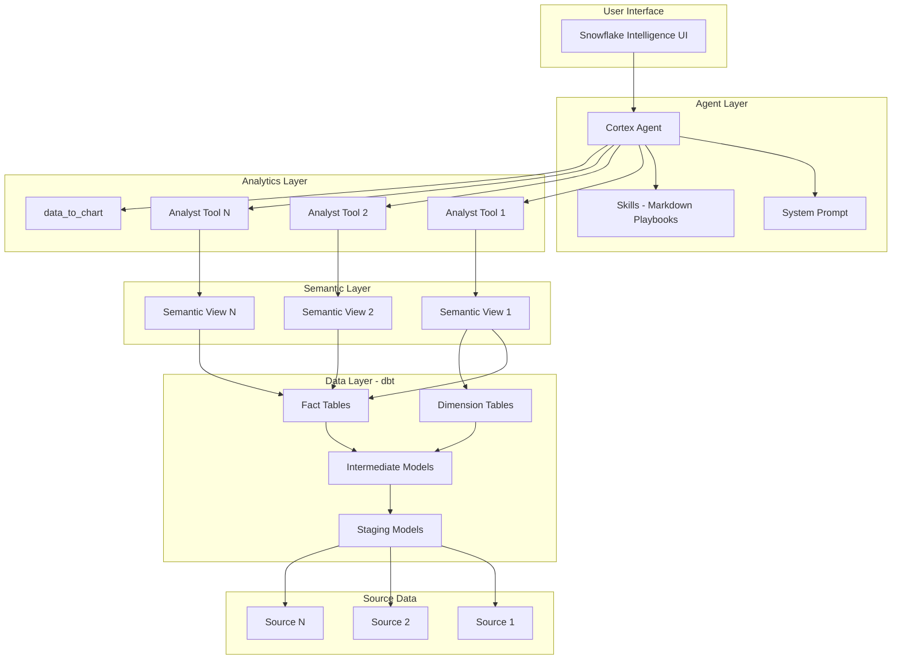
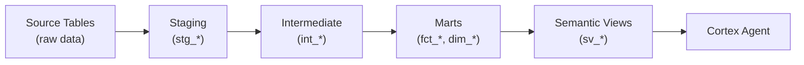
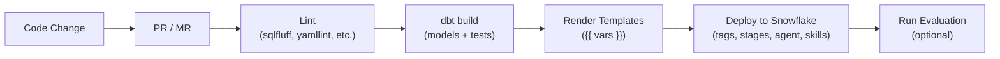

# Architecture

## System Overview

## Data Flow

## Deployment Pipeline

## Component Details

### Cortex Agent

The agent is a Snowflake object created via `CREATE OR REPLACE AGENT`. It orchestrates:

- **Cortex Analyst tools** — Text-to-SQL against semantic views
- **Skills** — Markdown playbooks for complex workflows
- **data_to_chart** — Visualization from query results

### Semantic Views

Semantic views are the analytical contract between raw data and the AI agent. They:

- Define what data is available (tables, columns)
- Specify relationships (joins, foreign keys)
- Classify columns as facts or dimensions
- Pre-define metrics (aggregations)
- Provide verified queries for grounding

### dbt Project

The dbt project transforms raw source data into clean, documented analytical tables:

- **Staging** — 1:1 source mapping, type casting, renaming
- **Intermediate** — Joins, business logic, deduplication
- **Marts** — Final analytical tables (facts and dimensions)
- **Semantic Views** — AI-readable analytical interface

### Skills

Skills are Markdown documents deployed to a Snowflake internal stage. They guide the agent through multi-step analytical workflows without executing code.

### CI/CD

The pipeline handles:

1. Linting (SQL, YAML, Markdown, Shell)
2. Template rendering (variable substitution)
3. Deployment (tags → stages → agent → skills → eval)
