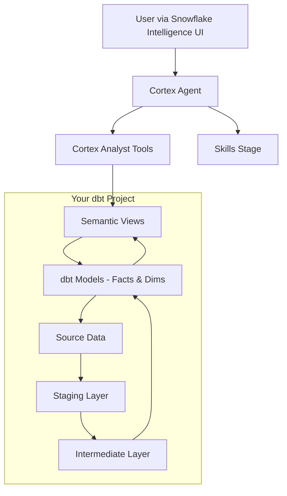

# Snowflake Cortex Agent Template

A production-ready template for building AI-powered data agents on Snowflake using Cortex Agents, Semantic Views, and dbt.

## What This Template Provides

- **Snowflake Cortex Agent** — A conversational AI agent that answers analytical questions using your data
- **Semantic Views via dbt** — Type-safe analytical interfaces that ground the agent's SQL generation
- **Skills System** — Prose-only Markdown playbooks for complex, repeatable agent workflows
- **Evaluation Framework** — Automated quality testing for agent responses
- **CI/CD Pipeline** — GitHub Actions for automated deployment
- **DevContainer** — Reproducible development environment
- **Linting** — SQL, YAML, Markdown, and shell script linting with auto-fix

## Architecture Overview



## Getting Started

1. **Fork this repository** to your GitHub/GitLab account
2. **Read [`SETUP.md`](SETUP.md)** — the comprehensive setup guide (human + AI readable)
3. **Fill in [`cookiecutter.yml`](cookiecutter.yml)** — your project configuration
4. **Follow the steps** in SETUP.md to get your agent running

## Project Structure

```text
├── cookiecutter.yml          # YOUR CONFIG — fill this in first
├── SETUP.md                  # Step-by-step setup guide
├── dbt/                      # Data models and semantic views
├── snowflake/                # Agent definition and Snowflake objects
├── cicd/                     # Deployment scripts
├── scripts/                  # Utility scripts
└── docs/                     # Additional documentation
```

## Key Concepts

### Semantic Views

Semantic views are the bridge between your data and the AI agent. They define:

- **What tables and columns exist** (TABLES)
- **How tables relate** (RELATIONSHIPS)
- **Which columns are measures vs. dimensions** (FACTS, DIMENSIONS)
- **Pre-defined calculations** (METRICS)
- **Grounding queries** (AI_VERIFIED_QUERIES)

### Agent Skills

Skills are Markdown documents that guide the agent through complex workflows. They don't execute code — they provide step-by-step instructions the agent follows using its tools.

### Template Variables

Files in `snowflake/` use `{{ variable }}` syntax. The `render_snowflake_templates.py` script resolves these from `cookiecutter.yml` before deployment.

## Documentation

- [`SETUP.md`](SETUP.md) — Complete setup guide (start here)
- [`ARCHITECTURE.md`](ARCHITECTURE.md) — System architecture
- [`AGENTS.md`](AGENTS.md) — Instructions for AI coding assistants
- [`docs/semantic-views-guide.md`](docs/semantic-views-guide.md) — How to write semantic views
- [`docs/authoring-skills.md`](docs/authoring-skills.md) — How to create agent skills
- [`docs/evaluation-guide.md`](docs/evaluation-guide.md) — How to evaluate your agent
- [`docs/customizing-ci-cd.md`](docs/customizing-ci-cd.md) — Adapting CI/CD to your org

## Requirements

- Snowflake Enterprise edition (or higher) with Cortex Agents enabled
- Python 3.12+
- Node.js 20+ (for markdownlint)
- dbt Cloud or dbt Core 1.11+
- Git

## License

This project is licensed under the MIT License — see [LICENSE](LICENSE).
